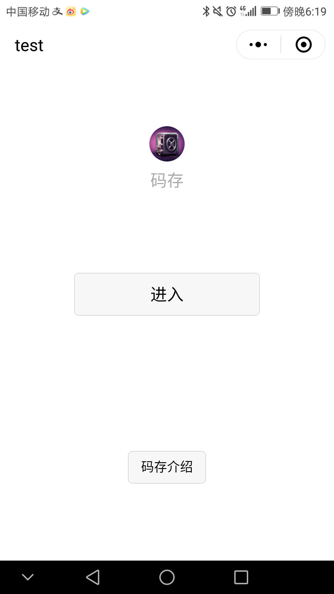
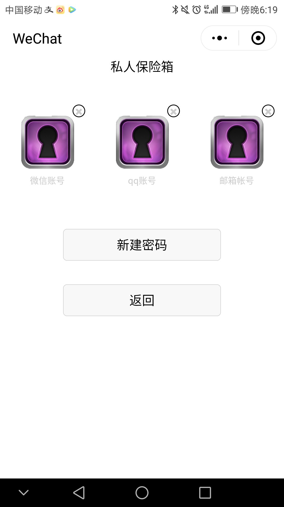
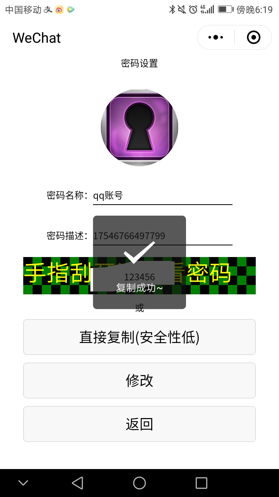
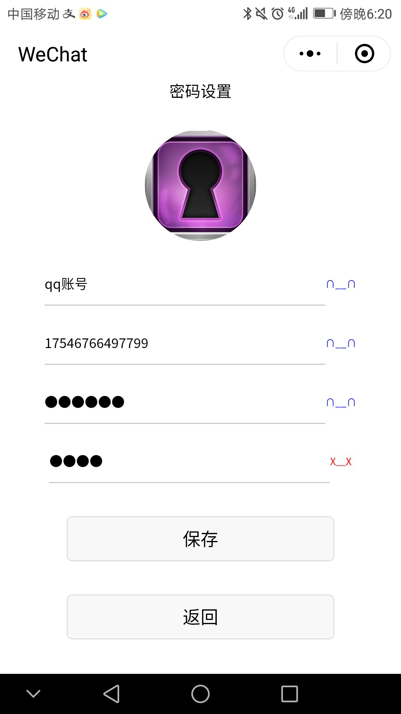
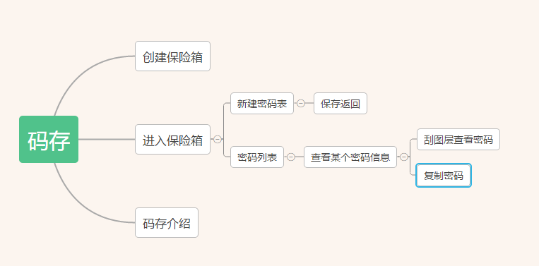

# macun
微信小程序 密码保存器  
由于公司业务需要学习开发微信小程序，所以写一个入门项目练练手。  
## 运行    
用了开源框架 `wepy`  
1，将仓库 `clone` 到本地  
2，安装依赖包  
3，全局安装 `wepy-cli` 工具  
4, `npm run dev` 编译代码，编译目录为 `dist`  
5，下载微信开发者工具并将工程目录设为 `dist`    
##  观看方法  
由于小程序正在接受审核，暂不提供入口。审核通过后放出入口  
放出几张项目截图  
### 入口：
  
### 密码列表
  
### 密码查看  
  
### 密码编辑  
   
##  功能  
很简单，这是一款不会窃取你密码的密码管理工具。功能也就一个，保存你的密码。密码是保存在本地的，你仅可以注册一个保险箱用来储存你的所有密码列表。  
点击对应的密码可以进行查看，每个密码包含密码名、备注信息，可以对其进行编辑。 
在新建密码页面，填写密码信息进行新增。  
在密码列表页面，长按密码进行删除操作。  
在密码查看页面，用手刮开格子图层可看到密码 或者 直接复制密码（不推荐，防止恶意软件获取粘贴板内容）  
在密码修改页面，可对密码信息进行编辑。  
## 思维脑图
  
## 数据储存  
所有的数据都储存在本地。调用了 `wx.setStorageSync` 接口，这保证了密码不在网络中传播。也引来了密码没有云端备份的危险，  
所以在删除或是更换设备时务必要手动备份密码。  

